# Stacks Database ER Diagram

This document contains the Entity-Relationship (ER) Diagram for the Stacks application database schema.

## ER Diagram

```mermaid
erDiagram
    USERS ||--o{ USER_BOOKS : "has"
    USERS ||--o{ SHELVES : "creates"
    USERS ||--o{ REVIEWS : "writes"
    USERS ||--o{ USER_BADGES : "earns"
    USERS ||--o{ READING_SESSIONS : "tracks"
    USERS ||--o{ READING_HISTORY : "has"
    USERS ||--o{ ACTIVITIES : "generates"
    USERS ||--o{ NOTIFICATIONS : "receives"
    
    USERS ||--o{ FRIENDS_USER1 : "friends with (as user1)"
    USERS ||--o{ FRIENDS_USER2 : "friends with (as user2)"
    USERS ||--o{ FRIEND_REQUESTS_REQUESTER : "sends"
    USERS ||--o{ FRIEND_REQUESTS_RECIPIENT : "receives"
    
    BOOKS ||--o{ USER_BOOKS : "included in"
    BOOKS ||--o{ REVIEWS : "reviewed in"
    BOOKS ||--o{ SHELF_BOOKS : "placed on"
    BOOKS ||--o{ BOOK_AUTHORS : "written by"
    BOOKS ||--o{ BOOK_GENRES : "categorized as"
    BOOKS ||--o{ ACTIVITIES : "referenced in"
    
    AUTHORS ||--o{ BOOK_AUTHORS : "writes"
    GENRES ||--o{ BOOK_GENRES : "categorizes"
    
    SHELVES ||--o{ SHELF_BOOKS : "contains"
    
    USER_BOOKS ||--o{ READING_SESSIONS : "has"
    USER_BOOKS ||--o{ ACTIVITIES : "generates"
    
    BADGES ||--o{ USER_BADGES : "earned as"
    BADGES ||--o{ ACTIVITIES : "referenced in"
    
    REVIEWS ||--o{ ACTIVITIES : "generates"
    
    USERS {
        int id PK
        string email UK
        string username UK
        string password_hash
        string display_name
        text bio
        string avatar_url
        json privacy_settings
        int total_books_read
        int total_pages_read
        datetime created_at
        datetime updated_at
        datetime last_login_at
    }
    
    BOOKS {
        int id PK
        string isbn UK
        string title
        string subtitle
        text description
        string cover_image_url
        date publication_date
        string publisher
        int page_count
        string language
        string source_api
        datetime fetched_at
        datetime created_at
        datetime updated_at
    }
    
    AUTHORS {
        int id PK
        string name
        text bio
        string photo_url
        date birth_date
        date death_date
        datetime created_at
        datetime updated_at
    }
    
    GENRES {
        int id PK
        string name UK
        int parent_genre_id FK
        datetime created_at
    }
    
    USER_BOOKS {
        int id PK
        int user_id FK
        int book_id FK
        string reading_status
        int rating
        text notes
        int current_page
        decimal completion_percentage
        date date_added
        date date_started
        date date_finished
        json custom_metadata
        datetime created_at
        datetime updated_at
    }
    
    READING_SESSIONS {
        int id PK
        int user_book_id FK
        date session_date
        int duration_minutes
        int pages_read
        text progress_notes
        string reading_location
        datetime created_at
    }
    
    READING_HISTORY {
        int id PK
        int user_id FK
        date history_date
        int pages_read
        int cumulative_pages_read
        int reading_streak_days
        datetime created_at
        datetime updated_at
    }
    
    SHELVES {
        int id PK
        int user_id FK
        string name
        text description
        string shelf_style
        int display_order
        string privacy_setting
        datetime created_at
        datetime updated_at
    }
    
    SHELF_BOOKS {
        int id PK
        int shelf_id FK
        int book_id FK
        int display_position
        text shelf_notes
        date date_added
        datetime created_at
    }
    
    REVIEWS {
        int id PK
        int user_id FK
        int book_id FK
        text review_content
        int rating
        int helpful_votes
        string status
        string privacy_setting
        datetime created_at
        datetime updated_at
    }
    
    FRIENDS {
        int id PK
        int user1_id FK
        int user2_id FK
        string status
        date date_connected
        datetime last_interaction_at
        datetime created_at
    }
    
    FRIEND_REQUESTS {
        int id PK
        int requester_id FK
        int recipient_id FK
        string status
        datetime created_at
        datetime responded_at
    }
    
    ACTIVITIES {
        int id PK
        int user_id FK
        string activity_type
        int target_book_id FK
        int target_review_id FK
        int target_badge_id FK
        json activity_metadata
        string visibility
        datetime created_at
    }
    
    BADGES {
        int id PK
        string name UK
        text description
        string category
        string tier
        string icon_url
        json unlock_criteria
        int points_value
        datetime created_at
    }
    
    USER_BADGES {
        int id PK
        int user_id FK
        int badge_id FK
        date date_earned
        decimal progress_to_next_tier
        int display_priority
        datetime created_at
    }
    
    BOOK_AUTHORS {
        int id PK
        int book_id FK
        int author_id FK
        string role
        int author_order
        datetime created_at
    }
    
    BOOK_GENRES {
        int id PK
        int book_id FK
        int genre_id FK
        string designation
        datetime created_at
    }
    
    NOTIFICATIONS {
        int id PK
        int recipient_id FK
        string notification_type
        int associated_friend_request_id FK
        int associated_review_id FK
        text notification_content
        boolean is_read
        datetime created_at
        datetime read_at
    }
```

## Relationship Descriptions

### Core Relationships

1. **USERS → USER_BOOKS** (One-to-Many)
   - A user can have many books in their collection
   - Foreign Key: `user_books.user_id` → `users.id`

2. **BOOKS → USER_BOOKS** (One-to-Many)
   - A book can be in many users' collections
   - Foreign Key: `user_books.book_id` → `books.id`

3. **USERS → SHELVES** (One-to-Many)
   - A user can create many custom shelves
   - Foreign Key: `shelves.user_id` → `users.id`

4. **SHELVES → SHELF_BOOKS** (One-to-Many)
   - A shelf can contain many books
   - Foreign Key: `shelf_books.shelf_id` → `shelves.id`

5. **BOOKS → SHELF_BOOKS** (One-to-Many)
   - A book can be placed on many shelves
   - Foreign Key: `shelf_books.book_id` → `books.id`

6. **USERS → REVIEWS** (One-to-Many)
   - A user can write many reviews
   - Foreign Key: `reviews.user_id` → `users.id`

7. **BOOKS → REVIEWS** (One-to-Many)
   - A book can have many reviews
   - Foreign Key: `reviews.book_id` → `books.id`

### Many-to-Many Relationships

8. **BOOKS ↔ AUTHORS** (Many-to-Many via BOOK_AUTHORS)
   - A book can have many authors
   - An author can write many books
   - Foreign Keys: `book_authors.book_id` → `books.id`, `book_authors.author_id` → `authors.id`

9. **BOOKS ↔ GENRES** (Many-to-Many via BOOK_GENRES)
   - A book can have many genres
   - A genre can categorize many books
   - Foreign Keys: `book_genres.book_id` → `books.id`, `book_genres.genre_id` → `genres.id`

10. **USERS ↔ USERS** (Many-to-Many via FRIENDS - Self-referential)
    - Users can be friends with other users
    - Foreign Keys: `friends.user1_id` → `users.id`, `friends.user2_id` → `users.id`

### Badge and Achievement Relationships

11. **BADGES → USER_BADGES** (One-to-Many)
    - A badge can be earned by many users
    - Foreign Key: `user_badges.badge_id` → `badges.id`

12. **USERS → USER_BADGES** (One-to-Many)
    - A user can earn many badges
    - Foreign Key: `user_badges.user_id` → `users.id`

### Activity and Social Relationships

13. **USERS → ACTIVITIES** (One-to-Many)
    - A user can generate many activities
    - Foreign Key: `activities.user_id` → `users.id`

14. **USER_BOOKS → READING_SESSIONS** (One-to-Many)
    - A user_book entry can have many reading sessions
    - Foreign Key: `reading_sessions.user_book_id` → `user_books.id`

15. **USERS → READING_HISTORY** (One-to-Many)
    - A user can have many reading history entries
    - Foreign Key: `reading_history.user_id` → `users.id`

16. **USERS → FRIEND_REQUESTS** (One-to-Many as Requester)
    - A user can send many friend requests
    - Foreign Key: `friend_requests.requester_id` → `users.id`

17. **USERS → FRIEND_REQUESTS** (One-to-Many as Recipient)
    - A user can receive many friend requests
    - Foreign Key: `friend_requests.recipient_id` → `users.id`

18. **USERS → NOTIFICATIONS** (One-to-Many)
    - A user can receive many notifications
    - Foreign Key: `notifications.recipient_id` → `users.id`

### Hierarchical Relationship

19. **GENRES → GENRES** (Self-referential for parent-child hierarchy)
    - A genre can have a parent genre
    - Foreign Key: `genres.parent_genre_id` → `genres.id`

## Entity Cardinalities

- **USERS**: One user can have many user_books, shelves, reviews, badges, activities
- **BOOKS**: One book can be in many user_books, shelves, and reviews
- **SHELVES**: One shelf belongs to one user and can contain many books
- **REVIEWS**: One review belongs to one user and one book (unique constraint: one review per user per book)
- **FRIENDS**: Represents bidirectional friendship (user1_id and user2_id reference users)
- **ACTIVITIES**: Polymorphic relationship - can reference books, reviews, or badges via target fields

