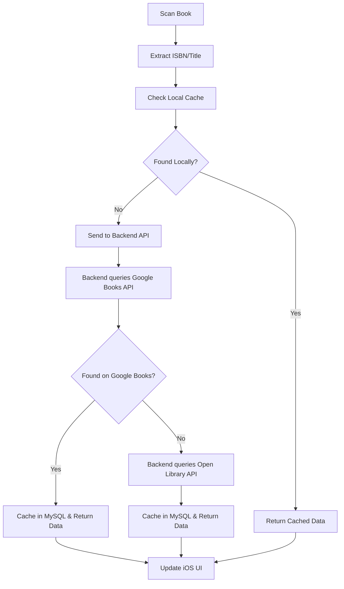

# Stacks

**Your personal library, everywhere.**

Stacks is a beautiful iOS app that lets you instantly capture, catalog, and organize your real-world book collection. Scan book covers or ISBNs to add them to your digital shelf, track what you own or want to read, and connect with friends to share reviews and reading journeys.

## Features

### 📚 Book Management
- **Instant Scanning**: Barcode/ISBN scanner with live camera integration
- **Cover OCR**: Recognizes book title & author from cover images
- **Smart Metadata**: Fetches comprehensive book details from Google Books & Open Library APIs
- **Manual Entry**: Add books by hand or correct scanned metadata
- **Duplicate Detection**: Alerts when books are already in your library

### 🏛️ Virtual Library
- **Beautiful Shelf Views**: Customizable shelf styles (wood, modern, vintage, etc.)
- **Drag & Drop**: Reorder books and move between shelves
- **Custom Organization**: Create personalized shelves and sections
- **Smart Filtering**: Sort by title, author, reading status, rating, genre
- **Fast Search**: Fuzzy search across your entire collection

### 📖 Reading Tracking
- **Reading Status**: Track "Read," "Currently Reading," "Want to Read"
- **Progress Tracking**: Monitor pages read and completion percentage
- **Personal Notes**: Attach private annotations and thoughts
- **Reading History**: View reading dates and completion timeline

### 🏆 Achievements & Badges
- **Gamified Experience**: Earn badges for reading milestones
- **Tiered Progression**: Bronze, Silver, Gold, Platinum, Diamond badges
- **Multiple Categories**: Reading, Collection, Social, Discovery achievements
- **Progress Tracking**: See progress toward next badge tier

### 👥 Social Features
- **User Profiles**: Customizable profiles with reading stats
- **Friend Network**: Connect with fellow readers
- **Review System**: Write and share book reviews
- **Activity Feed**: See friends' recent reading activity
- **Privacy Controls**: Granular control over what's shared

## App Vision & UI Mockups

> **Note**: This app was previously named "Intitled" but has been rebranded to "Stacks" to better reflect its focus on organizing and stacking your book collection.

Here's a preview of what Stacks will look like when complete. These mockups showcase the beautiful, intuitive interface designed for book lovers:

### 🏠 Homepage & Library Views

<table>
<tr>
<td width="20%">


*Clean, modern homepage with your reading progress and recent activity*

</td>
<td width="20%">


*Beautiful virtual bookshelf with customizable organization*

</td>
<td width="20%">


*Alternative shelf view with reading status indicators*

</td>
<td width="20%">


*Discover new books and recommendations*

</td>
<td width="20%">


*Detailed book information with reviews and ratings*

</td>
</tr>
</table>

### 📖 Reviews & User Experience

<table>
<tr>
<td width="20%">


*Write and read detailed book reviews*

</td>
<td width="20%">


*Quick book scanning with camera integration*

</td>
<td width="20%">


*Welcome experience for new users*

</td>
<td width="20%">


*Simple authentication flow*

</td>
<td width="20%">


*Easy account creation*

</td>
</tr>
<tr>
<td width="20%">


*Personal profile with reading stats and achievements*

</td>
<td width="20%">


*Navigation sidebar with all app features*

</td>
<td width="20%">

</td>
<td width="20%">

</td>
<td width="20%">

</td>
</tr>
</table>

## Architecture

Stacks follows **MVVM-C (Model-View-ViewModel-Coordinator)** architecture with a modern client-server architecture:

### Core Components

**iOS Client (SwiftUI)**
- **SwiftUI**: Modern, declarative UI framework
- **Core Data**: Local persistence and caching
- **VisionKit + AVFoundation**: Camera-based book scanning
- **Combine**: Reactive data flow and API communication

**Backend API Server**
- **MySQL Database**: Robust relational database for book metadata, user data, and social features
- **RESTful API**: Clean API endpoints for iOS app communication
- **Authentication**: Secure user authentication and session management
- **Book Metadata Integration**: Google Books & Open Library API integration

### Project Structure

```
Stacks/
├── Stacks/                          # iOS App (SwiftUI)
│   ├── Models/                     # Data models (User, Book, Shelf, Review, etc.)
│   ├── Views/                       # SwiftUI views organized by feature
│   │   ├── Authentication/         # Login, Sign Up, Onboarding
│   │   ├── Home/                    # Home screen and sidebar
│   │   ├── Explore/                 # Book discovery
│   │   ├── Scan/                    # Book scanning
│   │   ├── Library/                 # User's library
│   │   ├── BookDetail/              # Book detail page
│   │   ├── Review/                  # Review views
│   │   └── Profile/                 # User profile
│   ├── ViewModels/                  # MVVM view models
│   ├── Services/                    # API service interfaces and mock implementations
│   ├── DesignSystem/                # Theme, colors, typography, components
│   ├── StacksApp.swift             # App entry point
│   └── ContentView.swift           # Root view
├── Database-Assignment/             # Database schema and ER diagrams
├── UI-mockups/                      # Design mockups
└── README.md                        # This file

Backend API/ (To be implemented)
├── Database/                        # MySQL schema and migrations
├── API/                             # RESTful endpoints
├── Services/                        # Business logic and external API integration
└── Authentication/                  # User auth and session management
```

### Design Principles

- **Dark Mode First**: Beautiful dark theme with warm accent colors
- **Accessibility**: Full VoiceOver support and Dynamic Type
- **Performance**: Optimized for smooth scrolling and quick interactions
- **Offline Support**: Core functionality works without internet

## MySQL Database Entities

The following entities will be stored in the MySQL database to support all app features:

### Core Entities

1. **`users`** - User accounts and profiles
   - Authentication credentials (email, hashed password)
   - Profile information (username, display name, bio, avatar URL)
   - Account settings and privacy preferences
   - Reading statistics (total books read, pages read, etc.)
   - Account creation and last login timestamps

2. **`books`** - Book metadata (cached from Google Books & Open Library APIs)
   - ISBN (primary identifier for scanning)
   - Title, subtitle
   - Description/synopsis
   - Cover image URL
   - Publication date, publisher
   - Page count
   - Language
   - Source metadata (which API provided the data, last fetched timestamp)

3. **`authors`** - Book authors
   - Author name
   - Bio, photo URL (if available)
   - Birth/death dates (optional)

4. **`genres`** - Book genres/categories
   - Genre name (Fiction, Non-Fiction, Mystery, etc.)
   - Category hierarchy (if applicable)

### User-Book Relationships

5. **`user_books`** - User's collection and reading status
   - Links users to books (many-to-many)
   - Reading status ("Read", "Currently Reading", "Want to Read", "Owned")
   - Personal rating (1-5 stars)
   - Personal notes/annotations
   - Date added to collection
   - Date started reading
   - Date finished reading
   - Current page/progress (for currently reading books)
   - Completion percentage
   - Custom metadata (purchase date, location, condition)

6. **`reading_sessions`** - Detailed reading progress tracking
   - Links to user_books
   - Session date and duration
   - Pages read in session
   - Progress notes
   - Reading location/environment (optional)

7. **`reading_history`** - Historical reading data
   - Completed reading sessions aggregated by date
   - Cumulative pages read
   - Reading streaks and statistics

### Organization & Shelves

8. **`shelves`** - Custom shelves created by users
   - Shelf name and description
   - Shelf style/preferences (wood, modern, vintage, etc.)
   - Display order
   - Privacy settings (public/private)
   - Created and updated timestamps

9. **`shelf_books`** - Books placed on shelves (many-to-many)
   - Links shelves to books
   - Display position/order on shelf
   - Date added to shelf
   - Custom shelf-specific notes

### Social Features

10. **`reviews`** - User reviews of books
    - Links users to books
    - Review text content
    - Rating (1-5 stars)
    - Helpful votes count
    - Published status (draft/published)
    - Privacy settings
    - Created and updated timestamps

11. **`friends`** - Friend connections between users
    - Bidirectional relationship between two users
    - Friendship status (active/blocked)
    - Date connected
    - Last interaction timestamp

12. **`friend_requests`** - Pending friend requests
    - Requester and recipient user IDs
    - Request status (pending/accepted/rejected)
    - Created timestamp
    - Response timestamp

13. **`activities`** - Activity feed entries
    - Activity type (added book, finished reading, wrote review, earned badge, etc.)
    - Actor user ID
    - Target entity (book_id, review_id, badge_id, etc.)
    - Activity metadata (JSON)
    - Visibility/privacy settings
    - Created timestamp

### Badges & Achievements

14. **`badges`** - Badge definitions
    - Badge name and description
    - Badge category (Reading, Collection, Social, Discovery)
    - Badge tier (Bronze, Silver, Gold, Platinum, Diamond)
    - Badge icon/image URL
    - Unlock criteria (JSON or structured data)
    - Points/XP value

15. **`user_badges`** - Badges earned by users
    - Links users to badges
    - Date earned
    - Progress toward next tier (if applicable)
    - Display priority

### Additional Supporting Entities

16. **`book_authors`** - Many-to-many relationship between books and authors
    - Links books to authors
    - Author role/contribution type (author, co-author, illustrator, etc.)
    - Author order/priority for display

17. **`book_genres`** - Many-to-many relationship between books and genres
    - Links books to genres
    - Primary/secondary genre designation

18. **`notifications`** - User notifications
    - Notification type (friend request, review comment, activity mention, etc.)
    - Recipient user ID
    - Associated entity (friend_request_id, review_id, etc.)
    - Notification content
    - Read status
    - Created timestamp

### Indexes & Relationships

- **Primary Keys**: All tables include auto-incrementing `id` as primary key
- **Foreign Keys**: Proper foreign key constraints ensure referential integrity
- **Indexes**: 
  - ISBN on `books` (for fast scanning lookups)
  - User ID and book ID on `user_books` (for collection queries)
  - Email on `users` (for authentication)
  - Created timestamps on activity/feed tables (for chronological queries)
- **Unique Constraints**: 
  - ISBN uniqueness on `books`
  - Email uniqueness on `users`
  - Username uniqueness on `users`
  - One review per user per book on `reviews`

## Getting Started

### Prerequisites

- Xcode 15.0 or later
- iOS 17.0 or later
- Swift 5.9 or later
- macOS 14.0 or later (for development)

### iOS App Setup

1. **Clone the repository**
   ```bash
   git clone https://github.com/GabeGiancarlo/Stacks.git
   cd Stacks
   ```

2. **Open the project in Xcode**
   ```bash
   open Stacks.xcodeproj
   ```

3. **Add files to project** (if needed)
   - If Xcode prompts you to add files, accept all
   - Or manually add all Swift files from the `Stacks/` directory to the project

4. **Select a simulator**
   - Choose iPhone 15 Pro or any iOS 17+ simulator
   - Press `Cmd + R` to build and run

5. **Run the app**
   - The app will launch with an onboarding screen
   - You can create an account or login (mock authentication)
   - All features are functional with mock data

📋 **For detailed setup instructions, see [SETUP.md](SETUP.md)**

### Backend API Setup (Coming Soon)

The backend API server is currently in development. Once available:

1. **Configure MySQL database**
   ```bash
   mysql -u root -p < Database-Assignment/schema.sql
   ```

2. **Set up environment variables**
   - Configure database credentials
   - Add Google Books API key
   - Add Open Library API credentials

3. **Start the backend server**
   - Follow backend-specific setup instructions

4. **Connect iOS app to backend**
   - Update API base URL in service implementations
   - Replace mock services with real API calls

## Development

### Code Style

- **Swift**: Idiomatic Swift with modern async/await patterns
- **Architecture**: MVVM (Model-View-ViewModel) with protocol-based services
- **Concurrency**: Swift Concurrency (async/await) throughout
- **Testing**: Mock services ready for unit testing (target: ≥50% coverage)
- **Code Organization**: Feature-based folder structure

### Key Technologies

**iOS Client** ✅ **Implemented**
- **SwiftUI**: Modern declarative UI framework
- **Swift Concurrency**: async/await for all asynchronous operations
- **MVVM Architecture**: Clean separation of concerns
- **Protocol-Oriented**: Service interfaces for easy testing and swapping
- **Design System**: Reusable components and theming

**iOS Client** 🚧 **Planned**
- **Core Data**: Local persistence and caching (architecture ready)
- **VisionKit**: Advanced computer vision for book scanning (UI ready)
- **Combine**: Reactive programming for advanced features

**Backend Server** 🚧 **In Development**
- **MySQL**: Robust relational database for data persistence (schema designed)
- **RESTful API**: Clean HTTP endpoints for client communication
- **Authentication**: Secure user authentication and session management
- **External APIs**: Google Books & Open Library integration

### Contributing

1. Fork the repository
2. Create a feature branch (`git checkout -b feature/amazing-feature`)
3. Commit your changes (`git commit -m 'Add amazing feature'`)
4. Push to the branch (`git push origin feature/amazing-feature`)
5. Open a Pull Request

## API Integration

### Book Metadata Sources

1. **Google Books API** (Primary)
   - Comprehensive book database
   - High-quality cover images
   - Rich metadata including descriptions

2. **Open Library API** (Fallback)
   - Open source book database
   - Additional coverage for obscure titles

### Data Flow



## Current App State

### ✅ **iOS App - Complete** 
The SwiftUI iOS frontend is fully implemented and ready to use:

#### **Implemented Features**
- ✅ **Authentication Flow**: Complete onboarding, login, and signup screens
- ✅ **Main Navigation**: 5-tab structure (Home, Explore, Scan, Library, Profile) with sidebar
- ✅ **Home Screen**: Welcome dashboard with reading stats, currently reading, and activity feed
- ✅ **Library Management**: Book collection view with filtering by reading status
- ✅ **Book Details**: Comprehensive book information page with reviews
- ✅ **Review System**: Write and view book reviews with ratings
- ✅ **Explore/Discover**: Search functionality and genre browsing
- ✅ **Scan Interface**: Camera interface placeholder and manual ISBN entry
- ✅ **Profile**: User profile with stats, badges, goals, and settings

#### **Architecture & Code Quality**
- ✅ **MVVM Architecture**: Clean separation with ViewModels and Services
- ✅ **Async/Await**: Modern Swift concurrency throughout
- ✅ **Design System**: Complete dark-mode-first theme with reusable components
- ✅ **Data Models**: All models based on database schema, ready for API integration
- ✅ **Mock Services**: Fully functional mock services for development and testing
- ✅ **Code Organization**: Well-structured, maintainable codebase

#### **What's Working**
- All UI screens match the design mockups
- Navigation flows between all screens
- Mock data for testing all features
- Authentication state management
- Book collection management
- Review creation and display
- Reading status tracking

### ⚠️ **Next Steps**

#### 🗄️ **Backend API Development** - **IN PROGRESS**
**Status**: Schema designed, implementation needed
- ✅ MySQL database schema designed and documented
- ❌ Backend API server implementation needed
- ❌ Authentication endpoints required
- ❌ Book metadata API integration needed

**To connect the iOS app**:
1. Implement RESTful API endpoints matching the service interfaces
2. Replace `MockAuthService`, `MockBookService`, etc. with real implementations
3. Update API base URL in service configurations

#### 🍎 **Apple Developer Program** - **OPTIONAL**
**Status**: Not required for simulator testing
**Cost**: $99/year

**Needed for**:
- Testing on physical devices
- App Store distribution
- TestFlight beta testing
- Push notifications

👉 **[Enroll at developer.apple.com](https://developer.apple.com/programs/)** when ready for device testing

#### 📷 **Camera Integration** - **ENHANCEMENT**
**Status**: Interface ready, needs VisionKit implementation
- ✅ Scan screen UI implemented
- ❌ VisionKit integration for actual barcode/ISBN scanning
- ❌ Cover image OCR recognition

#### 💾 **Local Persistence** - **ENHANCEMENT**
**Status**: Architecture ready
- ✅ Data models support Codable for persistence
- ❌ Core Data implementation for offline support
- ❌ Local caching of book metadata

## Roadmap

### Phase 1: Foundation ✅ **COMPLETE**
- [x] Core architecture and data models
- [x] Authentication infrastructure (UI + mock services)
- [x] Design system and theming
- [x] Badge and achievement system (UI)
- [x] Complete SwiftUI frontend implementation
- [x] All screens matching UI mockups
- [x] Navigation and routing
- [x] Mock services for development

### Phase 2: Backend & API Integration 🚧 **IN PROGRESS**
- [x] MySQL database schema design
- [ ] MySQL database implementation
- [ ] RESTful API server development
- [ ] Authentication endpoints
- [ ] Book metadata API integration (Google Books & Open Library)
- [ ] Connect iOS app to backend API
- [ ] Replace mock services with real API calls

### Phase 3: Core Features Enhancement
- [ ] VisionKit integration for book scanning
- [ ] Core Data for local persistence
- [ ] Offline support and caching
- [ ] Image loading and caching
- [ ] Reading progress tracking
- [ ] Shelf management (create, edit, organize)

### Phase 4: Social Features
- [ ] Friend connections
- [ ] Activity feeds
- [ ] Badge system (backend integration)
- [ ] Notifications
- [ ] Privacy settings

### Phase 5: Advanced Features
- [ ] Book recommendations
- [ ] Reading challenges
- [ ] Export/import functionality
- [ ] Advanced analytics
- [ ] Reading streaks and statistics

### Phase 6: Expansion
- [ ] macOS app
- [ ] Web companion
- [ ] Third-party integrations
- [ ] Widget support

## License

This project is licensed under the MIT License - see the [LICENSE](LICENSE) file for details.

## Acknowledgments

- Beautiful UI design inspired by modern reading apps
- MySQL for robust database infrastructure
- Apple's SwiftUI and Core Data frameworks
- Open source book APIs for metadata
- Modern RESTful API architecture patterns

---

**Stacks** - Your books, beautifully organized. 📚✨ 