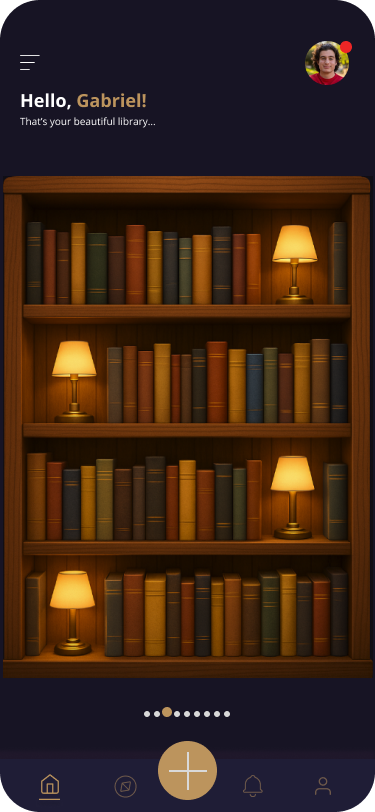
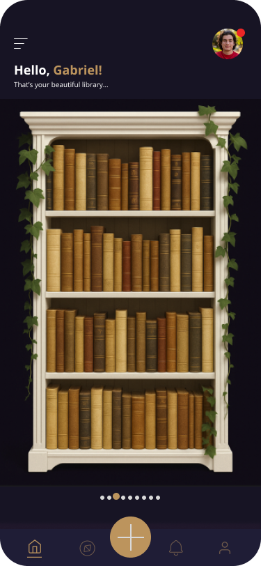
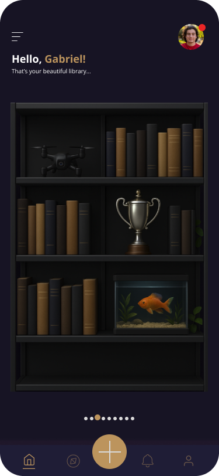
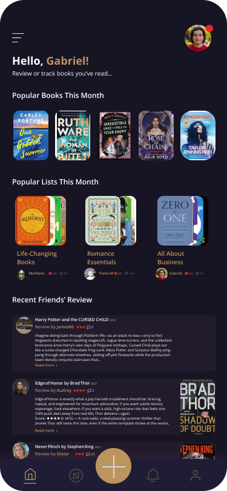
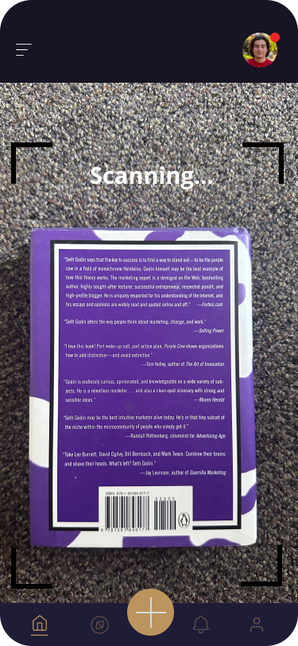
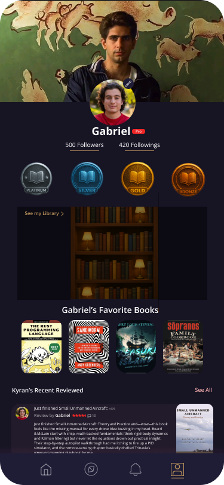
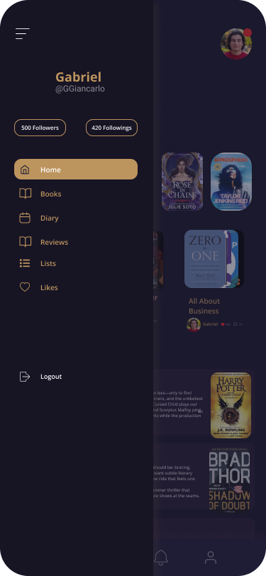
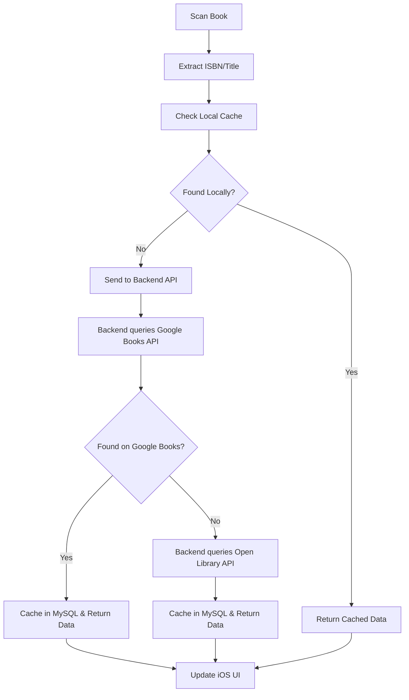

# Stacks

**Your personal library, everywhere.**

Stacks is a beautiful iOS app that lets you instantly capture, catalog, and organize your real-world book collection. Scan book covers or ISBNs to add them to your digital shelf, track what you own or want to read, and connect with friends to share reviews and reading journeys.

## Features

### 📚 Book Management
- **Instant Scanning**: Barcode/ISBN scanner with live camera integration
- **Cover OCR**: Recognizes book title & author from cover images
- **Smart Metadata**: Fetches comprehensive book details from Google Books & Open Library APIs
- **Manual Entry**: Add books by hand or correct scanned metadata
- **Duplicate Detection**: Alerts when books are already in your library

### 🏛️ Virtual Library
- **Beautiful Shelf Views**: Customizable shelf styles (wood, modern, vintage, etc.)
- **Drag & Drop**: Reorder books and move between shelves
- **Custom Organization**: Create personalized shelves and sections
- **Smart Filtering**: Sort by title, author, reading status, rating, genre
- **Fast Search**: Fuzzy search across your entire collection

### 📖 Reading Tracking
- **Reading Status**: Track "Read," "Currently Reading," "Want to Read"
- **Progress Tracking**: Monitor pages read and completion percentage
- **Personal Notes**: Attach private annotations and thoughts
- **Reading History**: View reading dates and completion timeline

### 🏆 Achievements & Badges
- **Gamified Experience**: Earn badges for reading milestones
- **Tiered Progression**: Bronze, Silver, Gold, Platinum, Diamond badges
- **Multiple Categories**: Reading, Collection, Social, Discovery achievements
- **Progress Tracking**: See progress toward next badge tier

### 👥 Social Features
- **User Profiles**: Customizable profiles with reading stats
- **Friend Network**: Connect with fellow readers
- **Review System**: Write and share book reviews
- **Activity Feed**: See friends' recent reading activity
- **Privacy Controls**: Granular control over what's shared

## App Vision & UI Mockups

> **Note**: This app was previously named "Intitled" but has been rebranded to "Stacks" to better reflect its focus on organizing and stacking your book collection.

Here's a preview of what Stacks will look like when complete. These mockups showcase the beautiful, intuitive interface designed for book lovers:

### 🏠 Homepage & Library Views

<table>
<tr>
<td width="20%">


*Clean, modern homepage with your reading progress and recent activity*

</td>
<td width="20%">


*Beautiful virtual bookshelf with customizable organization*

</td>
<td width="20%">


*Alternative shelf view with reading status indicators*

</td>
<td width="20%">


*Discover new books and recommendations*

</td>
<td width="20%">


*Detailed book information with reviews and ratings*

</td>
</tr>
</table>

### 📖 Reviews & User Experience

<table>
<tr>
<td width="20%">


*Write and read detailed book reviews*

</td>
<td width="20%">


*Quick book scanning with camera integration*

</td>
<td width="20%">


*Welcome experience for new users*

</td>
<td width="20%">


*Simple authentication flow*

</td>
<td width="20%">


*Easy account creation*

</td>
</tr>
<tr>
<td width="20%">


*Personal profile with reading stats and achievements*

</td>
<td width="20%">


*Navigation sidebar with all app features*

</td>
<td width="20%">

</td>
<td width="20%">

</td>
<td width="20%">

</td>
</tr>
</table>

## Architecture

Stacks follows **MVVM-C (Model-View-ViewModel-Coordinator)** architecture with a modern client-server architecture:

### Core Components

**iOS Client (SwiftUI)**
- **SwiftUI**: Modern, declarative UI framework
- **Core Data**: Local persistence and caching
- **VisionKit + AVFoundation**: Camera-based book scanning
- **Combine**: Reactive data flow and API communication

**Backend API Server**
- **MySQL Database**: Robust relational database for book metadata, user data, and social features
- **RESTful API**: Clean API endpoints for iOS app communication
- **Authentication**: Secure user authentication and session management
- **Book Metadata Integration**: Google Books & Open Library API integration

### Project Structure

```
iOS App (SwiftUI)/
├── StacksApp/           # Main app entry point and coordination
├── DataLayer/           # Core Data models and local persistence
├── ServicesLayer/       # API services and network layer
├── LibraryFeature/      # Library and shelf management
├── ScannerFeature/      # Book scanning functionality
├── ProfileFeature/      # User profiles and social features
├── DiscoverFeature/     # Book discovery and recommendations
└── Resources/           # Design system and shared resources

Backend API/
├── Database/            # MySQL schema and migrations
├── API/                 # RESTful endpoints
├── Services/            # Business logic and external API integration
└── Authentication/     # User auth and session management
```

### Design Principles

- **Dark Mode First**: Beautiful dark theme with warm accent colors
- **Accessibility**: Full VoiceOver support and Dynamic Type
- **Performance**: Optimized for smooth scrolling and quick interactions
- **Offline Support**: Core functionality works without internet

## MySQL Database Entities

The following entities will be stored in the MySQL database to support all app features:

### Core Entities

1. **`users`** - User accounts and profiles
   - Authentication credentials (email, hashed password)
   - Profile information (username, display name, bio, avatar URL)
   - Account settings and privacy preferences
   - Reading statistics (total books read, pages read, etc.)
   - Account creation and last login timestamps

2. **`books`** - Book metadata (cached from Google Books & Open Library APIs)
   - ISBN (primary identifier for scanning)
   - Title, subtitle
   - Description/synopsis
   - Cover image URL
   - Publication date, publisher
   - Page count
   - Language
   - Source metadata (which API provided the data, last fetched timestamp)

3. **`authors`** - Book authors
   - Author name
   - Bio, photo URL (if available)
   - Birth/death dates (optional)

4. **`genres`** - Book genres/categories
   - Genre name (Fiction, Non-Fiction, Mystery, etc.)
   - Category hierarchy (if applicable)

### User-Book Relationships

5. **`user_books`** - User's collection and reading status
   - Links users to books (many-to-many)
   - Reading status ("Read", "Currently Reading", "Want to Read", "Owned")
   - Personal rating (1-5 stars)
   - Personal notes/annotations
   - Date added to collection
   - Date started reading
   - Date finished reading
   - Current page/progress (for currently reading books)
   - Completion percentage
   - Custom metadata (purchase date, location, condition)

6. **`reading_sessions`** - Detailed reading progress tracking
   - Links to user_books
   - Session date and duration
   - Pages read in session
   - Progress notes
   - Reading location/environment (optional)

7. **`reading_history`** - Historical reading data
   - Completed reading sessions aggregated by date
   - Cumulative pages read
   - Reading streaks and statistics

### Organization & Shelves

8. **`shelves`** - Custom shelves created by users
   - Shelf name and description
   - Shelf style/preferences (wood, modern, vintage, etc.)
   - Display order
   - Privacy settings (public/private)
   - Created and updated timestamps

9. **`shelf_books`** - Books placed on shelves (many-to-many)
   - Links shelves to books
   - Display position/order on shelf
   - Date added to shelf
   - Custom shelf-specific notes

### Social Features

10. **`reviews`** - User reviews of books
    - Links users to books
    - Review text content
    - Rating (1-5 stars)
    - Helpful votes count
    - Published status (draft/published)
    - Privacy settings
    - Created and updated timestamps

11. **`friends`** - Friend connections between users
    - Bidirectional relationship between two users
    - Friendship status (active/blocked)
    - Date connected
    - Last interaction timestamp

12. **`friend_requests`** - Pending friend requests
    - Requester and recipient user IDs
    - Request status (pending/accepted/rejected)
    - Created timestamp
    - Response timestamp

13. **`activities`** - Activity feed entries
    - Activity type (added book, finished reading, wrote review, earned badge, etc.)
    - Actor user ID
    - Target entity (book_id, review_id, badge_id, etc.)
    - Activity metadata (JSON)
    - Visibility/privacy settings
    - Created timestamp

### Badges & Achievements

14. **`badges`** - Badge definitions
    - Badge name and description
    - Badge category (Reading, Collection, Social, Discovery)
    - Badge tier (Bronze, Silver, Gold, Platinum, Diamond)
    - Badge icon/image URL
    - Unlock criteria (JSON or structured data)
    - Points/XP value

15. **`user_badges`** - Badges earned by users
    - Links users to badges
    - Date earned
    - Progress toward next tier (if applicable)
    - Display priority

### Additional Supporting Entities

16. **`book_authors`** - Many-to-many relationship between books and authors
    - Links books to authors
    - Author role/contribution type (author, co-author, illustrator, etc.)
    - Author order/priority for display

17. **`book_genres`** - Many-to-many relationship between books and genres
    - Links books to genres
    - Primary/secondary genre designation

18. **`notifications`** - User notifications
    - Notification type (friend request, review comment, activity mention, etc.)
    - Recipient user ID
    - Associated entity (friend_request_id, review_id, etc.)
    - Notification content
    - Read status
    - Created timestamp

### Indexes & Relationships

- **Primary Keys**: All tables include auto-incrementing `id` as primary key
- **Foreign Keys**: Proper foreign key constraints ensure referential integrity
- **Indexes**: 
  - ISBN on `books` (for fast scanning lookups)
  - User ID and book ID on `user_books` (for collection queries)
  - Email on `users` (for authentication)
  - Created timestamps on activity/feed tables (for chronological queries)
- **Unique Constraints**: 
  - ISBN uniqueness on `books`
  - Email uniqueness on `users`
  - Username uniqueness on `users`
  - One review per user per book on `reviews`

## Getting Started

### Prerequisites

- Xcode 15.0 or later
- iOS 17.0 or later
- Swift 5.9 or later

<!-- ### Setup Instructions

*Setup instructions will be added once the backend API and iOS app structure are implemented.*

1. **Clone the repository**
   ```bash
   git clone https://github.com/GabeGiancarlo/Stacks.git
   cd Stacks
   ```

2. **Backend API Setup**
   ```bash
   # Navigate to backend directory
   cd backend/
   
   # Install dependencies (Node.js/Python/Go depending on implementation)
   npm install  # or pip install -r requirements.txt
   
   # Configure MySQL database
   # Create database and run migrations
   mysql -u root -p < database/schema.sql
   
   # Set environment variables
   cp .env.example .env
   # Edit .env with your database credentials and API keys
   ```

3. **iOS App Setup**
   ```bash
   # Navigate to iOS app directory
   cd ios/
   
   # Install dependencies via Swift Package Manager
   # Xcode will automatically resolve packages when you open the project
   ```

4. **Configure API Endpoints**
   - Update API base URL in iOS app configuration
   - Ensure backend server is running and accessible
   - Configure authentication endpoints

5. **Assets Setup** (Required for UI completion)
   ```
   Create an Assets.xcassets folder with:
   
   📁 Assets.xcassets/
   ├── 📁 AppIcon.appiconset/         # App icon variants
   ├── 📁 AccentColor.colorset/       # Gold accent color (#D4AF37)
   ├── 📁 ShelfTextures/              # Shelf background textures
   │   ├── classic-wood.imageset/     # Classic wood texture
   │   ├── modern-dark.imageset/      # Dark modern texture
   │   ├── vintage.imageset/          # Vintage wood texture
   │   └── white-minimal.imageset/    # Clean white texture
   ├── 📁 BookCovers/                 # Sample book cover images
   │   ├── placeholder-book.imageset/ # Default book cover
   │   └── sample-covers.imageset/    # Sample covers for demo
   └── 📁 BadgeIcons/                 # Custom badge graphics
       ├── bronze-badge.imageset/     # Bronze tier badge
       ├── silver-badge.imageset/     # Silver tier badge
       ├── gold-badge.imageset/       # Gold tier badge
       ├── platinum-badge.imageset/   # Platinum tier badge
       └── diamond-badge.imageset/    # Diamond tier badge
   ```

6. **Build and run**
   ```bash
   # Start backend server
   cd backend/
   npm start  # or python app.py / go run main.go
   
   # Build iOS app
   cd ios/
   open Stacks.xcodeproj
   ```
-->

## Development

### Code Style

- **Swift**: Idiomatic Swift with modern async/await patterns
- **Architecture**: MVVM-C with coordinator-driven navigation
- **Testing**: Comprehensive unit and integration tests (target: ≥50% coverage)
- **Linting**: SwiftLint configuration for consistent code style

### Key Technologies

**iOS Client**
- **SwiftUI**: Modern declarative UI framework
- **Core Data**: Local persistence and caching
- **VisionKit**: Advanced computer vision for book scanning
- **Combine**: Reactive programming for UI updates and API communication
- **Swift Package Manager**: Dependency management

**Backend Server**
- **MySQL**: Robust relational database for data persistence
- **RESTful API**: Clean HTTP endpoints for client communication
- **Authentication**: Secure user authentication and session management
- **External APIs**: Google Books & Open Library integration

### Contributing

1. Fork the repository
2. Create a feature branch (`git checkout -b feature/amazing-feature`)
3. Commit your changes (`git commit -m 'Add amazing feature'`)
4. Push to the branch (`git push origin feature/amazing-feature`)
5. Open a Pull Request

## API Integration

### Book Metadata Sources

1. **Google Books API** (Primary)
   - Comprehensive book database
   - High-quality cover images
   - Rich metadata including descriptions

2. **Open Library API** (Fallback)
   - Open source book database
   - Additional coverage for obscure titles

### Data Flow



## Current App State

### 🏗️ **Foundation Complete** ✅
The app currently shows:
- **Loading Screen**: Dark theme with Stacks logo and progress indicator
- **Authentication Flow**: Placeholder login/signup screens (ready for API integration)
- **Tab Navigation**: 5-tab structure (Home, Discover, Scan, Library, Profile)
- **Placeholder Views**: All major screens with "To be implemented" labels
- **Badge System**: Popup animations for earned achievements
- **Data Models**: Complete Core Data persistence layer ready for API integration

### ⚠️ **CRITICAL REQUIREMENTS NEEDED**

#### 🍎 **Apple Developer Program** - **REQUIRED** 
**Status**: ❌ **NOT ENROLLED** | **Cost**: $99/year

**Essential for**:
- Testing on physical devices (currently Simulator only)
- App Store distribution and TestFlight beta testing  
- Push notifications and production environment
- Proper code signing and entitlements

👉 **[Enroll at developer.apple.com](https://developer.apple.com/programs/)** before device testing

#### 🗄️ **Backend API Development** 
**Status**: ⚠️ **IN PROGRESS**
- ✅ MySQL database schema designed
- ❌ Backend API server implementation needed
- ❌ Authentication endpoints required
- ❌ Book metadata API integration needed

#### 🔥 **Firebase Configuration** 
**Status**: ⚠️ **PARTIALLY COMPLETE**
- ✅ Firebase project created (`intilted-v1`)
- ❌ May need migration to new backend architecture
- ❌ iOS App target needed in Xcode

### 🎨 **Design System Ready**
- **Dark-mode-first** color palette implemented
- **Typography scale** with comprehensive font definitions
- **Button styles** and component library
- **Animation presets** and haptic feedback
- **Custom shapes** for book spines and shelves

### 📱 **Next: Setup & Implementation**
**Immediate Steps**:
1. **🍎 Enroll in Apple Developer Program** ($99/year)
2. **🗄️ Implement Backend API Server** (MySQL + REST API)
3. **📱 Create iOS App target** in Xcode with proper bundle ID
4. **🔗 Connect iOS app to backend API**

**Then UI Development**:
5. Replace placeholder views with actual shelf visualizations
6. Add VisionKit scanner integration
7. Implement book detail and review interfaces
8. Connect to backend API for data persistence

📋 **See [DEVELOPMENT-STATUS.md](DEVELOPMENT-STATUS.md) for detailed progress tracking**

## Roadmap

### Phase 1: Foundation ✅
- [x] Core architecture and data models
- [x] Authentication infrastructure  
- [x] Design system and theming
- [x] Badge and achievement system
- [x] Local persistence with Core Data

### Phase 2: Backend & API Integration
- [ ] MySQL database implementation
- [ ] RESTful API server development
- [ ] Authentication endpoints
- [ ] Book metadata API integration

### Phase 3: Social Features
- [ ] Friend connections
- [ ] Review system
- [ ] Activity feeds
- [ ] Badge system

### Phase 4: Advanced Features
- [ ] Book recommendations
- [ ] Reading challenges
- [ ] Export/import functionality
- [ ] Advanced analytics

### Phase 5: Expansion
- [ ] macOS app
- [ ] Web companion
- [ ] Third-party integrations

## License

This project is licensed under the MIT License - see the [LICENSE](LICENSE) file for details.

## Acknowledgments

- Beautiful UI design inspired by modern reading apps
- MySQL for robust database infrastructure
- Apple's SwiftUI and Core Data frameworks
- Open source book APIs for metadata
- Modern RESTful API architecture patterns

---

**Stacks** - Your books, beautifully organized. 📚✨ 