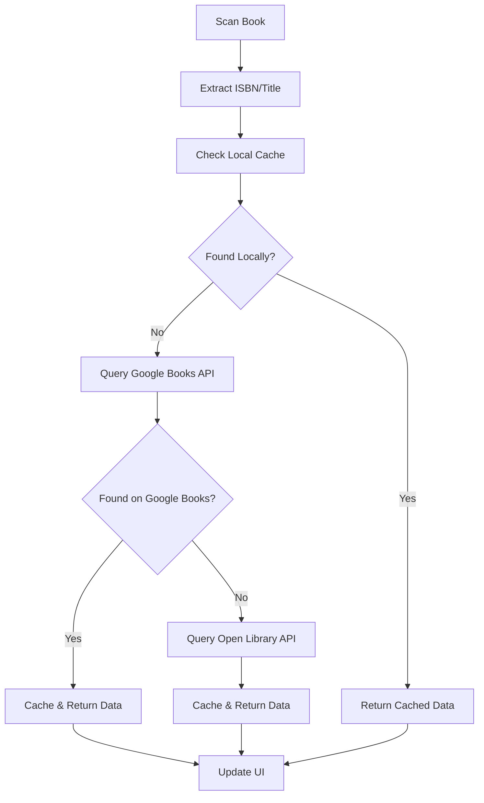

# Intitled

**Your personal library, everywhere.**

Intitled is a beautiful iOS app that lets you instantly capture, catalog, and organize your real-world book collection. Scan book covers or ISBNs to add them to your digital shelf, track what you own or want to read, and connect with friends to share reviews and reading journeys.

## Features

### 📚 Book Management
- **Instant Scanning**: Barcode/ISBN scanner with live camera integration
- **Cover OCR**: Recognizes book title & author from cover images
- **Smart Metadata**: Fetches comprehensive book details from Google Books & Open Library APIs
- **Manual Entry**: Add books by hand or correct scanned metadata
- **Duplicate Detection**: Alerts when books are already in your library

### 🏛️ Virtual Library
- **Beautiful Shelf Views**: Customizable shelf styles (wood, modern, vintage, etc.)
- **Drag & Drop**: Reorder books and move between shelves
- **Custom Organization**: Create personalized shelves and sections
- **Smart Filtering**: Sort by title, author, reading status, rating, genre
- **Fast Search**: Fuzzy search across your entire collection

### 📖 Reading Tracking
- **Reading Status**: Track "Read," "Currently Reading," "Want to Read"
- **Progress Tracking**: Monitor pages read and completion percentage
- **Personal Notes**: Attach private annotations and thoughts
- **Reading History**: View reading dates and completion timeline

### 🏆 Achievements & Badges
- **Gamified Experience**: Earn badges for reading milestones
- **Tiered Progression**: Bronze, Silver, Gold, Platinum, Diamond badges
- **Multiple Categories**: Reading, Collection, Social, Discovery achievements
- **Progress Tracking**: See progress toward next badge tier

### 👥 Social Features
- **User Profiles**: Customizable profiles with reading stats
- **Friend Network**: Connect with fellow readers
- **Review System**: Write and share book reviews
- **Activity Feed**: See friends' recent reading activity
- **Privacy Controls**: Granular control over what's shared

## Architecture

Intitled follows **MVVM-C (Model-View-ViewModel-Coordinator)** architecture with dependency injection:

### Core Components

- **SwiftUI**: Modern, declarative UI framework
- **SwiftData + CloudKit**: Local persistence with cloud sync
- **Firebase Auth & Firestore**: Authentication and social features
- **VisionKit + AVFoundation**: Camera-based book scanning
- **Combine**: Reactive data flow

### Project Structure

```
Sources/
├── IntitledApp/          # Main app entry point and coordination
├── DataLayer/           # Core Data models and persistence
├── ServicesLayer/       # API services and business logic
├── LibraryFeature/      # Library and shelf management
├── ScannerFeature/      # Book scanning functionality
├── ProfileFeature/      # User profiles and social features
├── DiscoverFeature/     # Book discovery and recommendations
├── ShopFeature/         # Book purchasing integration
└── Resources/           # Design system and shared resources
```

### Design Principles

- **Dark Mode First**: Beautiful dark theme with warm accent colors
- **Accessibility**: Full VoiceOver support and Dynamic Type
- **Performance**: Optimized for smooth scrolling and quick interactions
- **Offline Support**: Core functionality works without internet

## Getting Started

### Prerequisites

- Xcode 15.0 or later
- iOS 17.0 or later
- Swift 5.9 or later

### Setup Instructions

1. **Clone the repository**
   ```bash
   git clone https://github.com/GabeGiancarlo/intitled.git
   cd intitled
   ```

2. **Install dependencies**
   ```bash
   # Dependencies are managed via Swift Package Manager
   # Xcode will automatically resolve packages when you open the project
   ```

3. **Configure Firebase**
   - Firebase project: `intilted-v1` is already configured
   - **📋 Detailed Setup Guide**: See [docs/Firebase-Setup.md](docs/Firebase-Setup.md) for comprehensive configuration
   - Firebase Console: [https://console.firebase.google.com/u/0/project/intilted-v1](https://console.firebase.google.com/u/0/project/intilted-v1/authentication/users)
   - Add iOS app with bundle identifier `com.intitled.intilted-v1`
   - Download `GoogleService-Info.plist` and add to project root
   - Authentication methods enabled:
     - ✅ Email/Password authentication
     - ✅ Phone authentication ([Firebase iOS Phone Auth](https://firebase.google.com/docs/auth/ios/phone-auth))
   - ✅ Firestore Database configured for social features
   - ✅ Security rules implemented
   - ✅ Email customization ready ([Firebase Auth Email Customization](https://support.google.com/firebase/answer/7000714))

4. **Configure CloudKit**
   - CloudKit container: `iCloud.com.intitled.intilted-v1` (pre-configured)
   - Enable CloudKit in your Apple Developer account
   - CloudKit database setup matches Firebase project naming

5. **Assets Setup** (Required for UI completion)
   ```
   Create an Assets.xcassets folder with:
   
   📁 Assets.xcassets/
   ├── 📁 AppIcon.appiconset/         # App icon variants
   ├── 📁 AccentColor.colorset/       # Gold accent color (#D4AF37)
   ├── 📁 ShelfTextures/              # Shelf background textures
   │   ├── classic-wood.imageset/     # Classic wood texture
   │   ├── modern-dark.imageset/      # Dark modern texture
   │   ├── vintage.imageset/          # Vintage wood texture
   │   └── white-minimal.imageset/    # Clean white texture
   ├── 📁 BookCovers/                 # Sample book cover images
   │   ├── placeholder-book.imageset/ # Default book cover
   │   └── sample-covers.imageset/    # Sample covers for demo
   └── 📁 BadgeIcons/                 # Custom badge graphics
       ├── bronze-badge.imageset/     # Bronze tier badge
       ├── silver-badge.imageset/     # Silver tier badge
       ├── gold-badge.imageset/       # Gold tier badge
       ├── platinum-badge.imageset/   # Platinum tier badge
       └── diamond-badge.imageset/    # Diamond tier badge
   ```

6. **Build and run**
   ```bash
   # Open in Xcode
   open Package.swift
   
   # Or build from command line
   swift build
   ```

## Development

### Code Style

- **Swift**: Idiomatic Swift with modern async/await patterns
- **Architecture**: MVVM-C with coordinator-driven navigation
- **Testing**: Comprehensive unit and integration tests (target: ≥50% coverage)
- **Linting**: SwiftLint configuration for consistent code style

### Key Technologies

- **SwiftData**: Modern data persistence with CloudKit sync
- **VisionKit**: Advanced computer vision for book scanning
- **Combine**: Reactive programming for UI updates
- **Firebase**: Authentication and real-time social features
- **Swift Package Manager**: Dependency management

### Contributing

1. Fork the repository
2. Create a feature branch (`git checkout -b feature/amazing-feature`)
3. Commit your changes (`git commit -m 'Add amazing feature'`)
4. Push to the branch (`git push origin feature/amazing-feature`)
5. Open a Pull Request

## API Integration

### Book Metadata Sources

1. **Google Books API** (Primary)
   - Comprehensive book database
   - High-quality cover images
   - Rich metadata including descriptions

2. **Open Library API** (Fallback)
   - Open source book database
   - Additional coverage for obscure titles

### Data Flow



## Current App State

### 🏗️ **Foundation Complete** ✅
The app currently shows:
- **Loading Screen**: Dark theme with Intitled logo and progress indicator
- **Authentication Flow**: Placeholder login/signup screens (ready for Firebase integration)
- **Tab Navigation**: 5-tab structure (Home, Discover, Scan, Library, Profile)
- **Placeholder Views**: All major screens with "To be implemented" labels
- **Badge System**: Popup animations for earned achievements
- **Data Models**: Complete SwiftData persistence layer ready for UI implementation

### ⚠️ **CRITICAL REQUIREMENTS NEEDED**

#### 🍎 **Apple Developer Program** - **REQUIRED** 
**Status**: ❌ **NOT ENROLLED** | **Cost**: $99/year

**Essential for**:
- Testing on physical devices (currently Simulator only)
- App Store distribution and TestFlight beta testing  
- Push notifications and CloudKit production environment
- Proper code signing and entitlements

👉 **[Enroll at developer.apple.com](https://developer.apple.com/programs/)** before device testing

#### 🔥 **Firebase Configuration** 
**Status**: ⚠️ **PARTIALLY COMPLETE**
- ✅ Firebase project created (`intilted-v1`)
- ❌ Missing `GoogleService-Info.plist` (download from Firebase Console)
- ❌ iOS App target needed in Xcode

### 🎨 **Design System Ready**
- **Dark-mode-first** color palette implemented
- **Typography scale** with comprehensive font definitions
- **Button styles** and component library
- **Animation presets** and haptic feedback
- **Custom shapes** for book spines and shelves

### 📱 **Next: Setup & UI Implementation**
**Immediate Steps**:
1. **🍎 Enroll in Apple Developer Program** ($99/year)
2. **📱 Create iOS App target** in Xcode with proper bundle ID
3. **🔥 Add GoogleService-Info.plist** from Firebase Console

**Then UI Development**:
4. Replace placeholder views with actual shelf visualizations
5. Add VisionKit scanner integration
6. Implement book detail and review interfaces

📋 **See [DEVELOPMENT-STATUS.md](DEVELOPMENT-STATUS.md) for detailed progress tracking**

## Roadmap

### Phase 1: Foundation ✅
- [x] Core architecture and data models
- [x] Authentication infrastructure  
- [x] Design system and theming
- [x] Badge and achievement system
- [x] Local persistence with CloudKit sync

### Phase 2: Social Features
- [ ] Friend connections
- [ ] Review system
- [ ] Activity feeds
- [ ] Badge system

### Phase 3: Advanced Features
- [ ] Book recommendations
- [ ] Reading challenges
- [ ] Export/import functionality
- [ ] Advanced analytics

### Phase 4: Expansion
- [ ] macOS app
- [ ] Web companion
- [ ] Third-party integrations

## License

This project is licensed under the MIT License - see the [LICENSE](LICENSE) file for details.

## Acknowledgments

- Beautiful UI design inspired by modern reading apps
- Firebase for robust backend infrastructure
- Apple's SwiftUI and SwiftData frameworks
- Open source book APIs for metadata

---

**Intitled** - Your books, beautifully organized. 📚✨ 